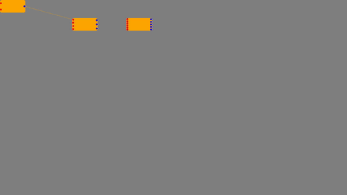

# Yewflow

A library inspired by [React Flow](https://reactflow.dev), but made for Yew.

It is not a perfect copy, nor does it include all the features that React Flow has.

The current features are:
- A fully-functional panel that can be dragged and zoomed in.
- Nodes that can be dragged around and customized to your liking.
- Straight and bezier edges that can be customized to your liking.

Some features that are missing:
- No built-in way to add edge labels
- Stress testing is failing
- No proper tests yet

To get started, I recommend you check out the example in the [examples](examples) folder.

### Contribution

Naturally, contributions are welcome. Just open a pull request and I will be notified.

DISCLAIMER: This is my first proper project in Rust. Any feedback on the code is appreciated.

### License

This project is licensed under MIT license. See [LICENSE-MIT](LICENSE-MIT) for more information.